# Smart Finance Tracker

## Project Description
*"Smart Finance Tracker"* is a mobile application for automated expense tracking integrated with the **Monobank API** for financial data and the **OpenAI API** for analytics and recommendations.  
The application allows users to:
- Analyse their expenses using categorisation (MCC codes).
- Receive recommendations on how to save money.
- Build flexible graphs by various financial indicators.

## Features
- **Integration with Monobank API:** automatic retrieval of financial data.
- **Artificial intelligence:** expense analytics and recommendations.
- **Dynamic graphs**: display of expenses, income, and other indicators.

## Technologies
- **Frontend:** React Native.
- **Backend:** Node.js (Express, Sequelize, Nodemailer).
- **API:** Monobank API, OpenAI API.
- **Database:** MySQL.

## Installation process
1. Clone the repo:

   ```bash
   git clone https://github.com/yourusername/openai-monobank-expense-tracker.git
   cd openai-monobank-expense-tracker
   ``` 
2. Install all dependencies

    ```bash
    cd backend
    npm install

    cd ../mobile
    npm install
    ```
3. Launch the server and the mobile application. 

    ```bash
    # For the backend
    cd backend
    npm start
    # In the dev mode
    npm run nodemon

    # For the frontend you need to open new terminal and run
    cd mobile
    npm run android-local
    ```
    
## Screenshots

<div style="display: flex; flex-direction: 'row'; gap: 5px; flex-wrap: wrap; align-items: center; justify-content: center;">
    
    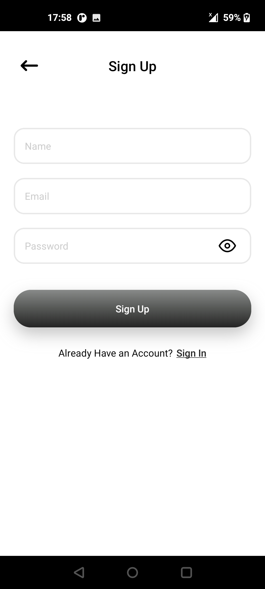
    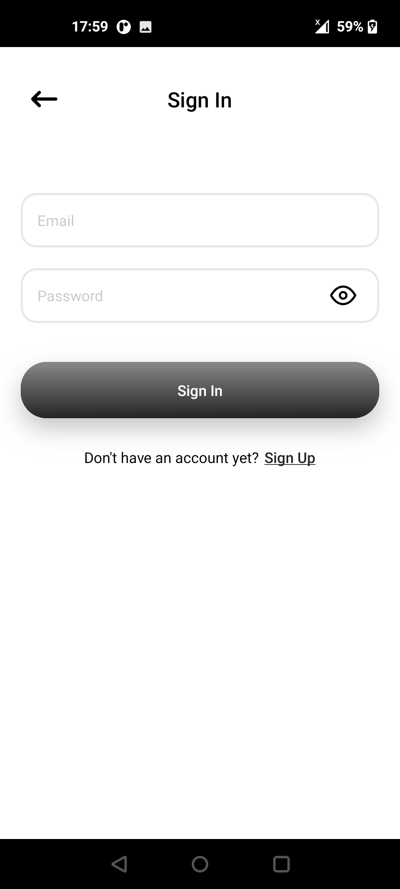
    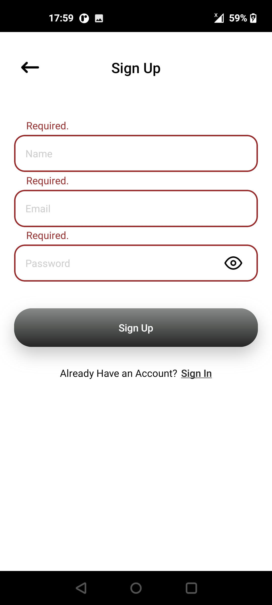
    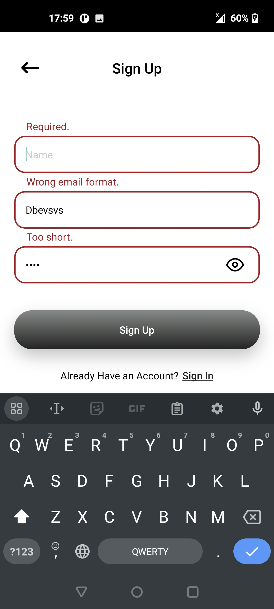
    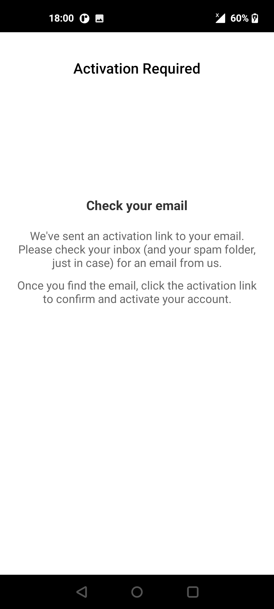
    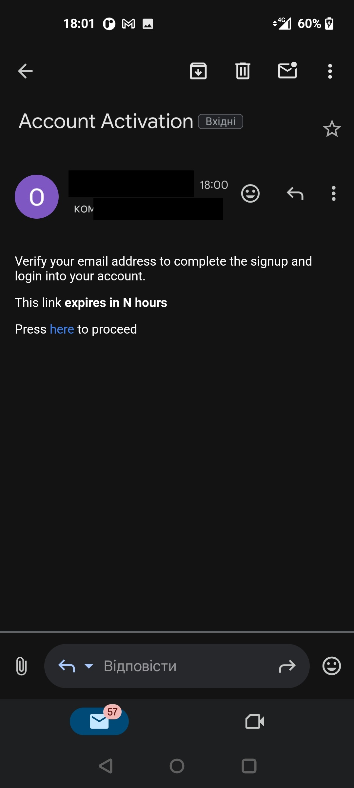
    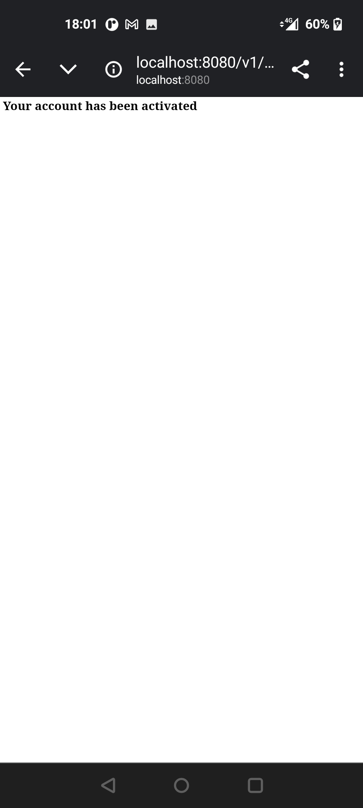
    
    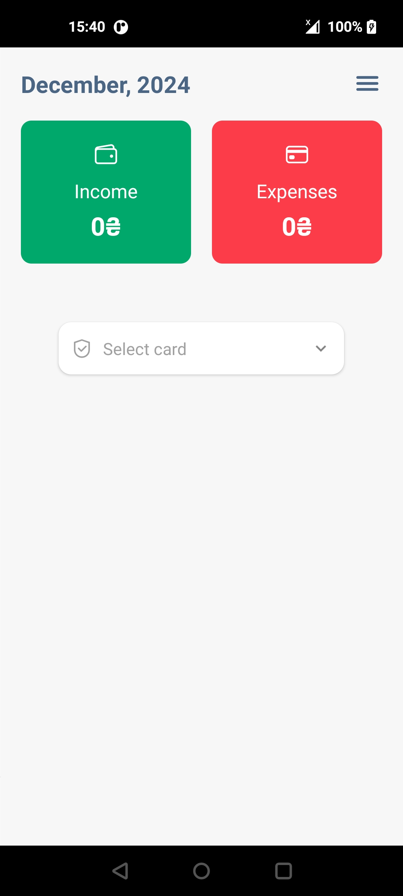
    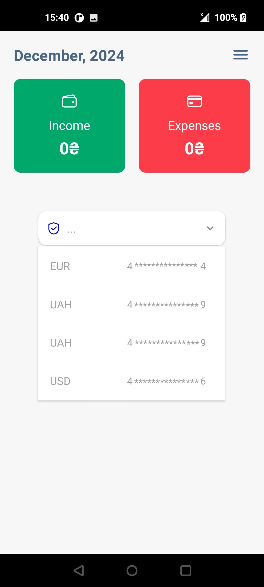
    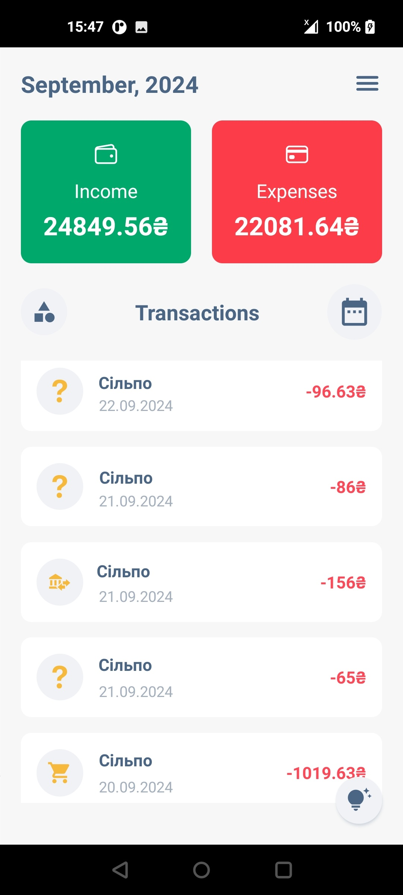
    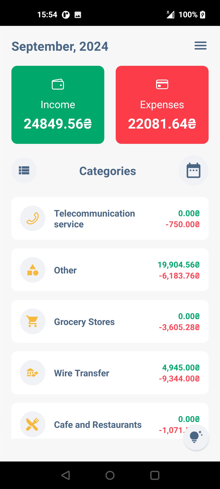
    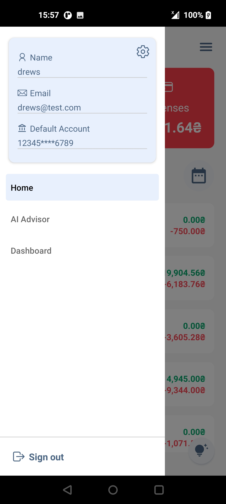
    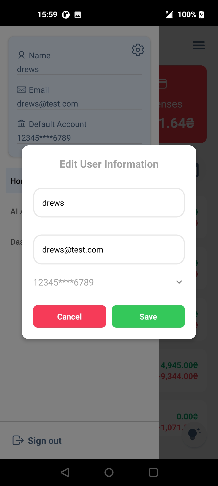
    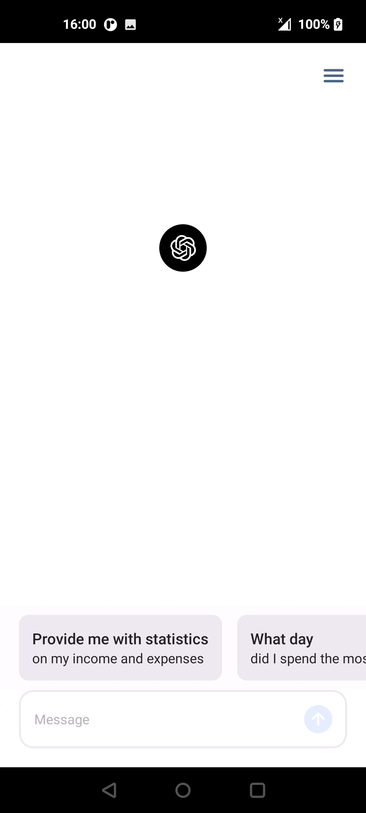
    
    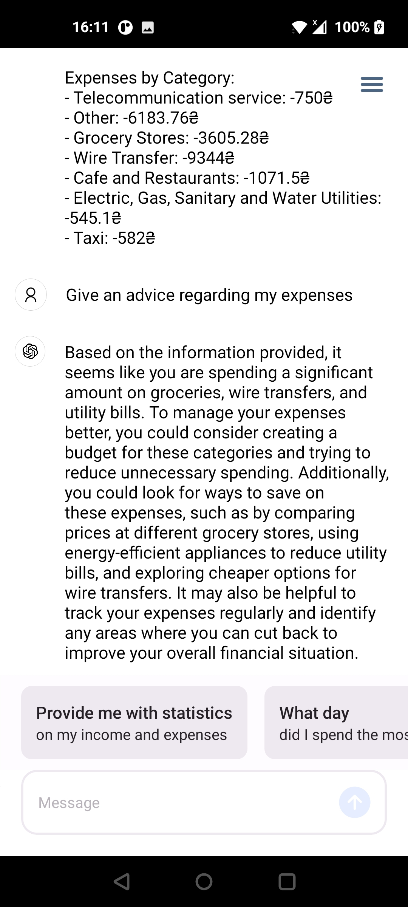
    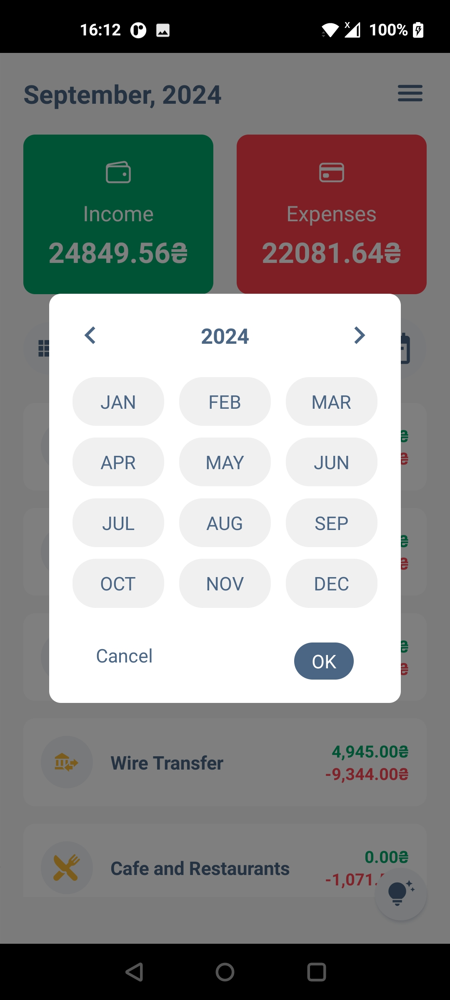
    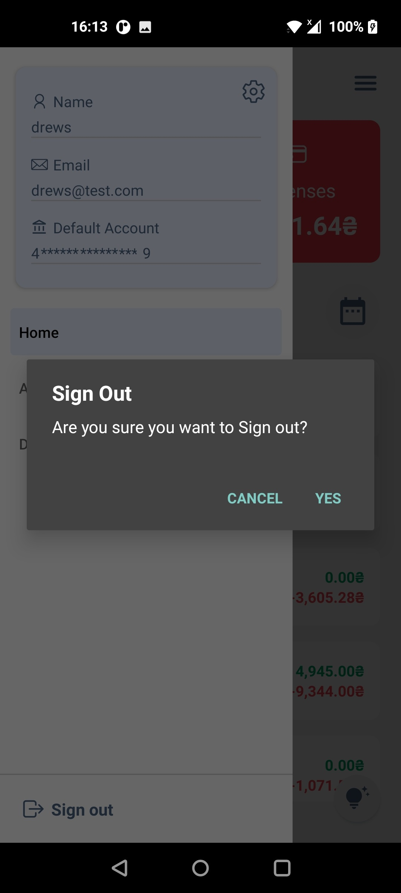
    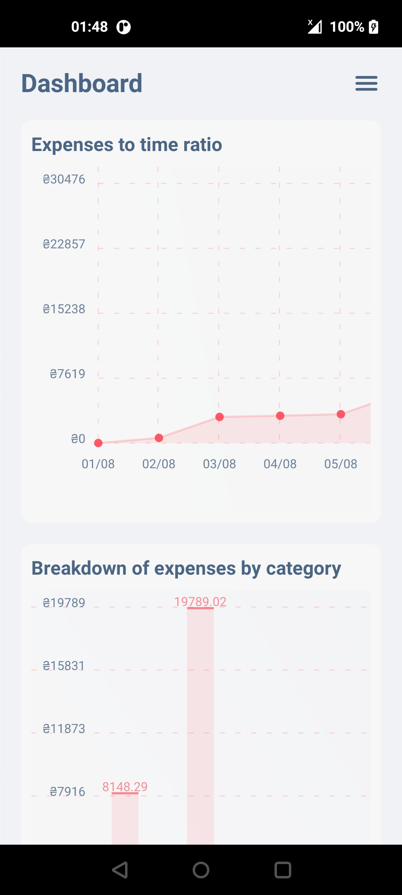
    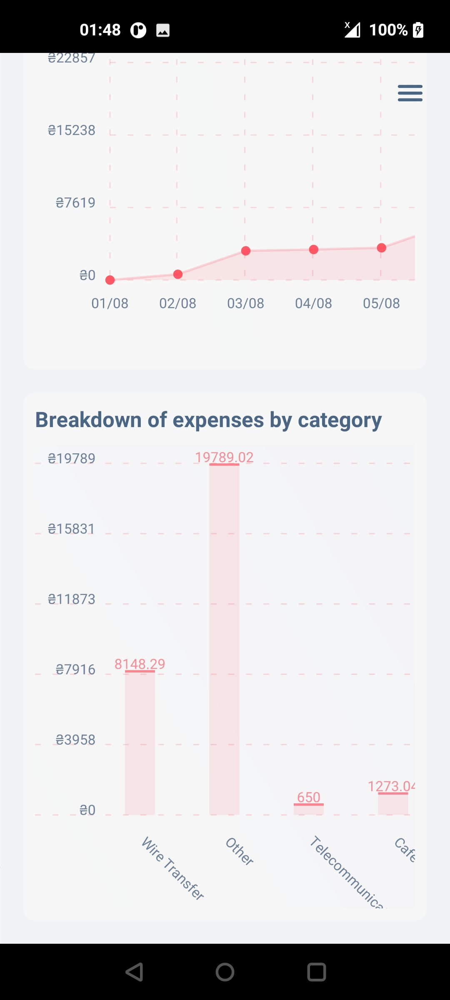
</div>

## Demo

<div style="display: flex; flex-direction: 'row';">
    
    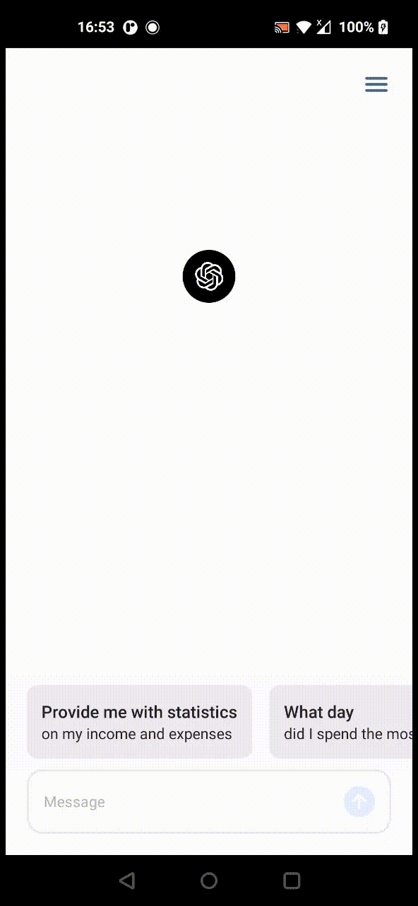
 
</div>